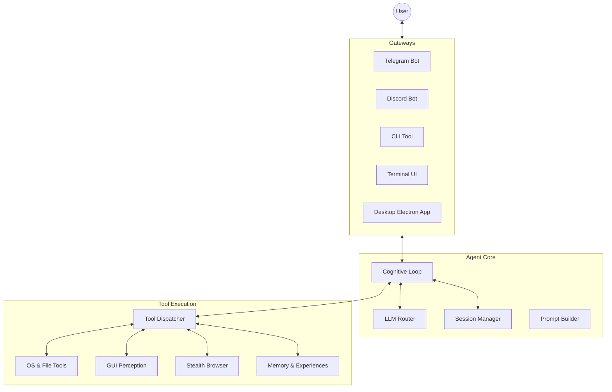
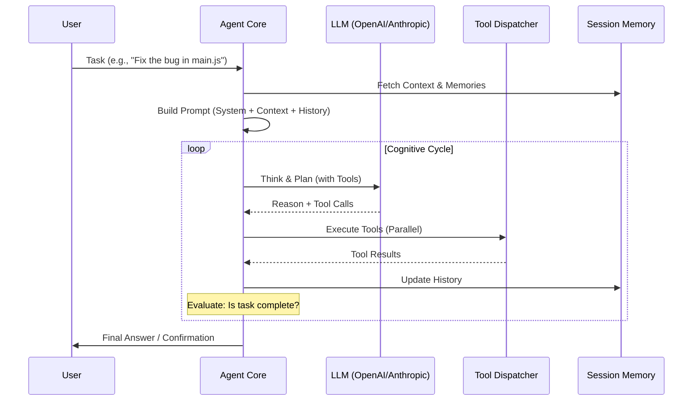
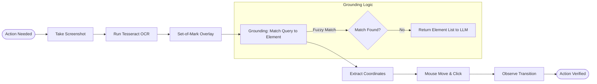
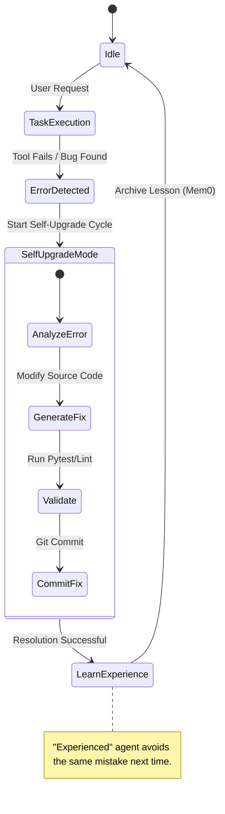
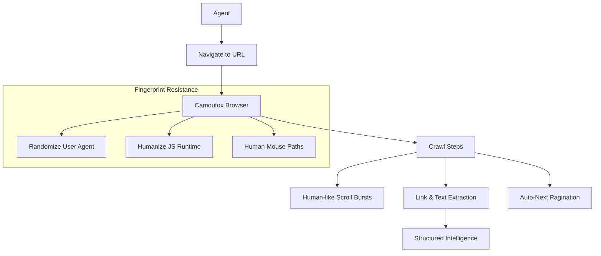
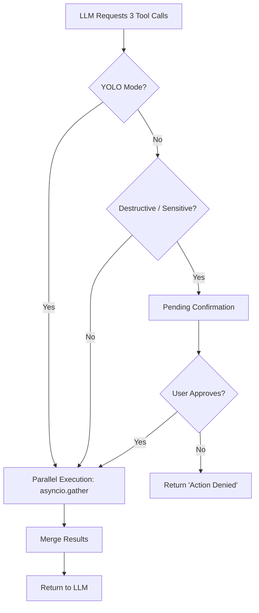
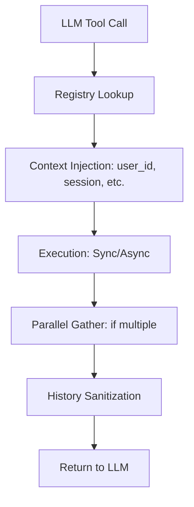

# Project Yolo

Project Yolo is an elite, highly autonomous AI system controller and expert software engineer agent. It acts as an orchestrator capable of solving complex software engineering, research, and general desktop tasks end-to-end. Built with a decoupled LLM architecture, it primarily operates via a chat gateway (Telegram/Discord) but also supports CLI and standalone server modes.

## Contributing

Contributions are welcome! Please read the [Contributing Guide](CONTRIBUTING.md) before submitting a PR.

## Table of Contents
- [Core Capabilities](#core-capabilities)
- [System Architecture & Flows](#system-architecture--flows)
- [Desktop Interface](#desktop-interface)
- [Tool System](#tool-system)
- [Architecture & Internals](#architecture--internals)
- [Prerequisites & Dependencies](#prerequisites--dependencies)
- [Setup & Installation](#setup--installation)
- [Configuration](#configuration)
- [Usage & Gateways](#usage--gateways)
- [Safety & Sandboxing](#safety--sandboxing)
- [License](#license)

---

## Core Capabilities

- **Autonomous Execution Engine (`agent.py`)**: A deep-reasoning cognitive loop that can think step-by-step, generate plans, and autonomously use tools. Supported execution modes:
  - **YOLO mode**: Full autonomy, zero human intervention.
  - **Safe mode**: Human-in-the-loop (HITL) confirmation required for destructive or sensitive tool actions.
  - **Think mode**: Dynamic cognitive mode (`auto`, `on`, `off`) that forces Yolo to plan multi-step tasks thoroughly before acting.

- **GUI Perception & Interaction (`gui_ops.py`)**: UI-TARS-inspired perception-first GUI interaction. Utilizing `pytesseract`, `opencv`, and `pyautogui`, Yolo perceives the screen state, draws Set-of-Mark (SoM) overlays, and grounds its actions to actual UI elements rather than blindly clicking coordinates.
  - *Abilities*: Analyze screen, find elements, click elements, read text regions, observe transitions before and after clicks.

- **Advanced Stealth Browsing**: Powered by `cloverlabs-camoufox` for fingerprinting resistance and stealthy web interactions, enabling Yolo to crawl, read, and extract intelligence from modern websites effectively without getting blocked.
  - *Abilities*: Pagination handling, deep link extraction, JavaScript execution, scrolling, and DOM interaction.

- **Multimodal Intelligence (`bot.py`)**: 
  - **Text**: Send commands natively in plain text.
  - **Vision**: Upload photos for visual OCR (via OpenAI Vision).
  - **Audio**: Upload audio/voice notes for instant transcription and analysis.

- **LLM Agnostic (`llm_router.py`)**: Intercepts and routes calls seamlessly across LLM providers:
  - OpenAI (`gpt-4o-mini`, `gpt-4o`)
  - Anthropic (`claude-3-5-sonnet`)
  - OpenRouter
  - Local / OpenAI-compatible proxy endpoints (e.g., GitHub Copilot proxies).

- **Continuous Operation & Evolution**: 
  - **Memories**: Long-term persistent user context.
  - **Experiences**: Records of past bug fixes and technical lessons learned (`experience_ops.py`).
  - **Self Upgrade**: Yolo can optimize its own skills and schedule background/cron tasks (`cron_ops.py`).

---

## System Architecture & Flows

This section provides a technical deep-dive into the inner workings of Project Yolo.

### 1. High-Level Architecture
Project Yolo is built on a "Decoupled Agent Core" pattern. The core cognitive logic is independent of the gateway (Telegram, CLI, Desktop, etc.).



### 2. Agent Cognitive Loop (The "Think-Act-Observe" Cycle)
The agent doesn't just call tools; it reasons, plans, and validates.



### 3. GUI Perception Pipeline (UI-TARS Inspired)
How the agent "sees" and interacts with your desktop.



### 4. Self-Evolution & Experience Learning
How Yolo gets smarter over time by fixing its own bugs.



### 5. Stealth Browsing Architecture (Camoufox)
Bypassing anti-bot measures for deep research.



### 6. Multi-Tool Execution & HITL Safety
Handling parallel tool calls and Human-In-The-Loop safety.



---

## Desktop Interface

The Yolo Desktop app is a premium Electron-based interface for interacting with the Yolo AI agent. It provides a real-time, fluid chat experience with syntax highlighting and markdown support.

### 🏗️ Desktop Architecture


- **Renderer**: Built with vanilla HTML/JS and `motion` for smooth animations.
- **Main**: Handles system-level events and bridge communication.
- **API Bridge**: (`api_bridge.py`) Exposes the agent's cognitive loop via an IPC channel or local socket.

---

## Tool System

Project Yolo is equipped with a vast library of 60+ specialized tools that allow it to interact with the OS, web, and its own codebase.

### 🛠️ Core Tool Categories

- **GUI Perception (`gui_ops.py`)**: UI-TARS Grounding, SoM numbered overlays, and state transition validation.
- **Stealth Browsing (`browser_ops.py`)**: Camoufox engine with humanized mouse paths and automated pagination.
- **File & OS Operations (`file_ops.py`, `system_ops.py`)**: Filesystem mastery and bash execution with parallel background support.
- **Memory & Evolution (`memory_ops.py`, `experience_ops.py`)**: Long-term persistence via vector DB and automated technical lesson learning.

### 🏗️ Tool Dispatcher Flow



---

## Architecture & Internals

- `agent.py`: The main cognitive engine. Manages prompt formatting, parses LLM responses, manages tool sequences, and enforces safety boundaries.
- `llm_router.py`: LLM provider abstraction and connection routing.
- `session.py`: Message history and execution state management. Handles history compaction to preserve context windows.
- `tools/`: A powerful suite of system, OS, memory, and application operations.
  - `background_ops.py`: Dispatch parallel background agents.
  - `gui_ops.py`: See, find, analyze, and manipulate screen objects.
  - `experience_ops.py` / `memory_ops.py`: Save and recall long-term knowledge.
  - `artifact_ops.py`: Generate structured, persistent deliverables.
  - `mission_ops.py`: Oversee large, serialized research plans.
- `bot.py` / `discord_gateway.py` / `cli.py` / `server.py`: Front-end adapters for messaging, terminal, and API access.

## Prerequisites & Dependencies

- **Python**: 3.9+ 
- **Tesseract OCR**: Required for GUI interactions.
  - Linux: `sudo apt install tesseract-ocr` or `sudo pacman -S tesseract`
  - macOS: `brew install tesseract`
  - Windows: Download and install from [UB Mannheim's Tesseract page](https://github.com/UB-Mannheim/tesseract/wiki). Ensure `tesseract.exe` is added to your System PATH.
- **System Utils**:
  - Linux: `wmctrl` or `xdotool` to manage and read active window statuses.
  - Windows: `pygetwindow` (installed automatically via `requirements.txt`).
- **Node.js**: Expected if running web applications concurrently.

## Setup & Installation

1. **Clone the repository:**
   ```bash
   git clone <repository_url>
   cd project-Yolo
   ```

2. **Create and activate a virtual environment:**
   ```bash
   python -m venv .venv
   source .venv/bin/activate
   ```

3. **Install dependencies:**
   ```bash
   pip install -r requirements.txt
   ```

4. **Initialize configurations (Optional):**
   - **Linux:** Run `./install.sh` to symlink config files.
   - **Windows:** Run `powershell -ExecutionPolicy Bypass -File install.ps1` to symlink config files.

## Configuration

Copy the example config and adjust as necessary:
```bash
cp .env.example .env
```
Key Variables:
- `LLM_PROVIDER`: `auto`, `openai`, `anthropic`, `openrouter`, or `compatible`
- `OPENAI_API_KEY`: API Key for the default intelligence engine.
- `TELEGRAM_BOT_TOKEN`: Token from BotFather for the Telegram gateway.
- `TELEGRAM_ALLOWED_USER_IDS`: Comma-separated list of your Telegram Account IDs for authorization.
- `DISCORD_BOT_TOKEN`: Token for the Discord integration.

## Usage & Gateways

Yolo can be run in multiple ways depending on your workflow:

### Telegram Gateway (Primary)

Start the Telegram bot:
```bash
python bot.py
```
From Telegram, you can:
- Message the bot natural language tasks. Example: `"Set up a new React project in the artifacts directory and deploy a simple hello world app."`
- Toggle modes: `/mode yolo` or `/mode safe`.
- Toggle "Think" logic for complex tasks: `/think auto` or `/think on`.
- View experiences, memories, and active schedules via `/experiences`, `/memories`, `/schedules`.
- Upload Images/Audio directly for the agent to analyze.

### CLI Access

You can directly interact with the agent from the terminal for local testing:
```bash
python cli.py
```

### Discord Gateway

To run the agent on Discord:
```bash
python discord_gateway.py
```

### Server Endpoint (Multi-Gateway)

Start Webhooks, Telegram, and Discord concurrently, along with a health monitor:
```bash
python server.py --mode all
```

## Safety and Sandboxing

> [!WARNING]
> Yolo has the capability to write, delete, and modify system files, as well as interact with your active desktop GUI. 

It is highly recommended to run Yolo within an isolated sandbox, virtual machine, or container when utilizing full YOLO mode, or ensure `/mode safe` is active so you can manually approve tool executions in the chat client.

## License

All rights reserved. Use at your own risk.
